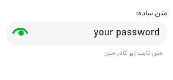

# jb-password-input-react

> [!WARNING]  
> this package is deprecated and moved to [jb-password-input/react](https://github.com/javadbat/jb-password-input/tree/main/react)

password input react component
this component props and functionality are all come from [jb-input-react](https://github.com/javadbat/jb-input-react) just for password input so for doc just read jb-input-react document
in jb-time-input you can create a input special for time the advantage is:

- all jb-input benefits include customizations, validation,...
- show password toggle button to let user see inputted password


 Demo: [codeSandbox preview](https://3f63dj.csb.app/samples/jb-password-input) for just see the demo and [codeSandbox editor](https://codesandbox.io/p/sandbox/jb-design-system-3f63dj?file=%2Fsrc%2Fsamples%2FJBPasswordInput.tsx) if you want to see and play with code
## Demo image:    



### set password level

jb-password has some default validation check series that you can set by just set the `level` prop of the component

```ts
//level list
type PasswordValidationLevel ="NONE" | "BASIC" | "PRO"
//NONE is no default validation
//BASIC just check for password length
//PRO check password length + numeric and special char included
```
```jsx
<JBPasswordInput level="PRO"></JBPasswordInput>
```
you may not set the level and just set your own validation but we put this option for ease of use.

## Other Related Docs:

- see [jb-password-input](https://github.com/javadbat/jb-password-input) if you want to use this as a web-component in a pure-js app or any other framework.

- see [All JB Design system Component List](https://github.com/javadbat/design-system/blob/master/docs/component-list.md) for more components.

- use [Contribution Guide](https://github.com/javadbat/design-system/blob/master/docs/contribution-guide.md) if you want to contribute in this component.